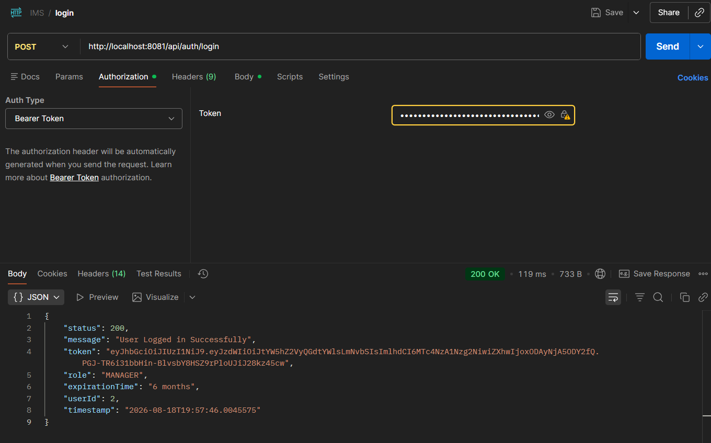
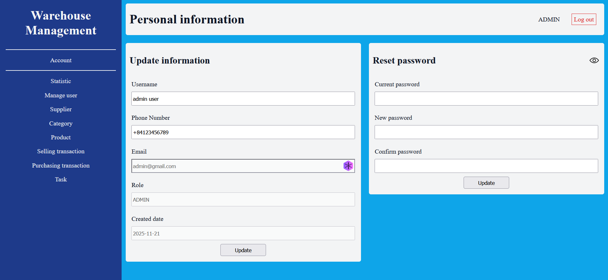
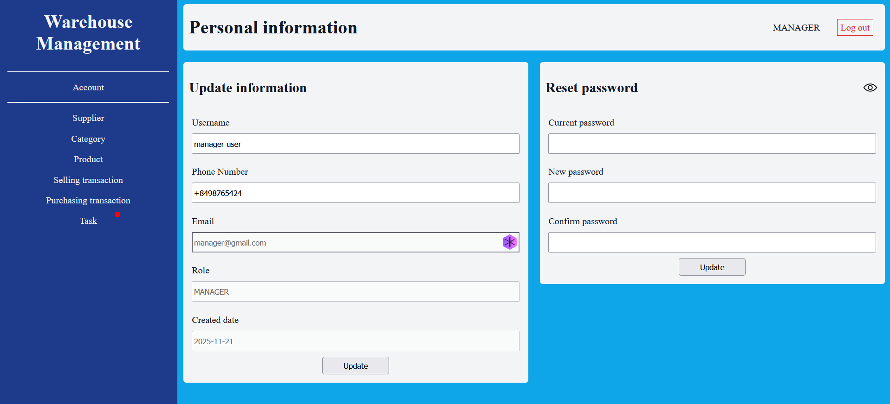
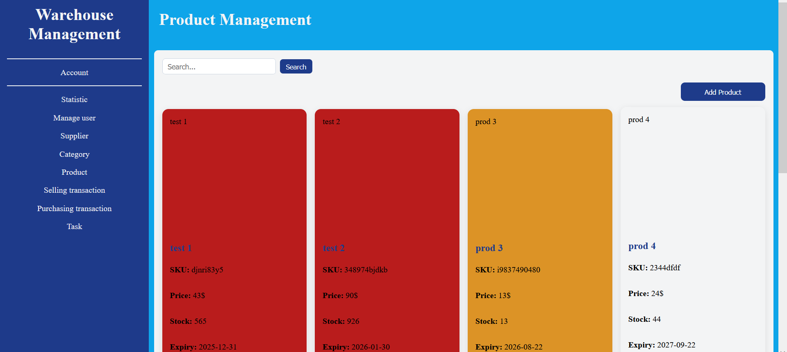
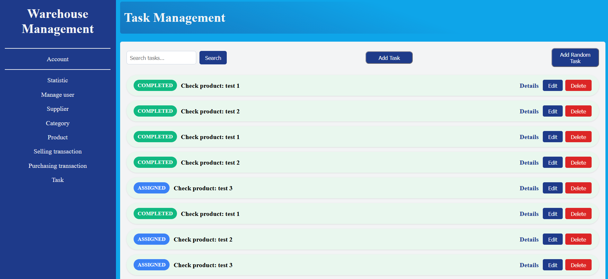
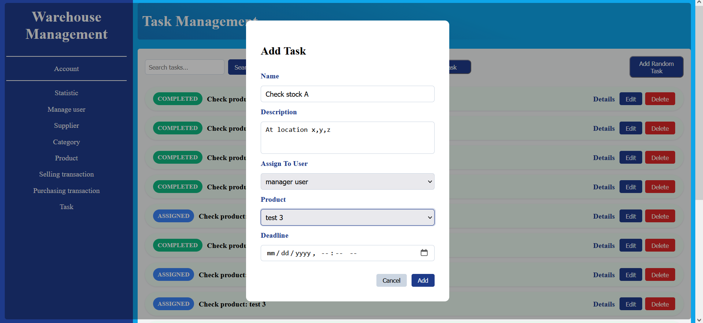
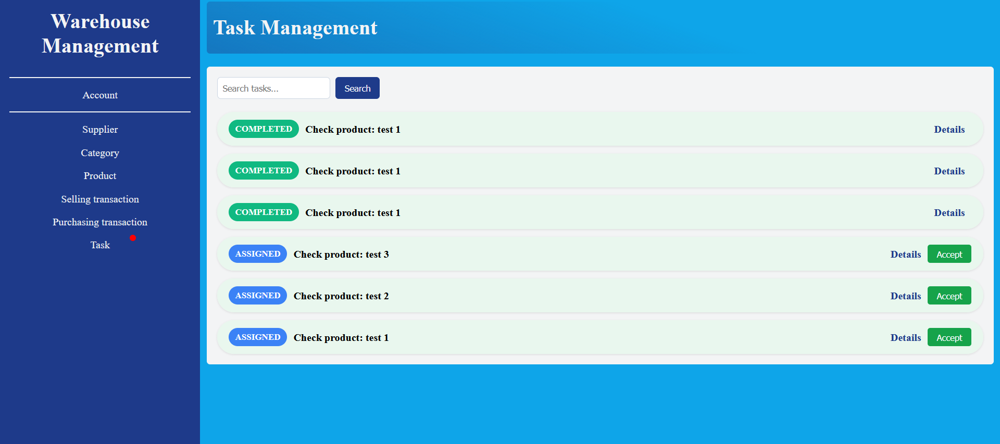

# Warehouse Management System

This is the frontend application for a full-stack Warehouse Management System. It connects to a Spring Boot REST API and utilizes a MySQL database to efficiently manage inventory, suppliers, user roles, transactions, and task assignments.

## Technologies Used

* **Frontend framework:** Angular (utilizing Standalone Components and Reactive Forms)
* **Languages:** TypeScript, HTML, CSS
* **Backend support:** Spring Boot (RESTful APIs, JWT Authentication)
* **Database:** MySQL

---

## Local Setup & Configuration

1. Clone this repository to your local machine.
2. Navigate to the root directory in your terminal.
3. Run `npm install` to install all required dependencies.
4. Ensure your Spring Boot backend and MySQL server are running on port `8081`.
5. Run `ng serve` to launch the Angular development server.
6. Open your browser and navigate to `http://localhost:4200`.

If you are setting up the database from scratch, verify your backend connection with these commands:

```sql
show databases;
create database warehouse_db;
use warehouse_db;
select u.id, u.email from users u;
```

## Application Demo & Key Features
# 1. Authentication Flow





The application secures endpoints using JSON Web Tokens (JWT). Users begin at the login screen and authenticate against the backend. The server returns a JWT and user metadata (Role, User ID), which the Angular frontend stores directly in localStorage. Route access is strictly protected by AdminGuard, ManagerGuard, and AuthGuard, ensuring users can only reach pages authorized for their specific role. All outbound HTTP requests pass through the authInterceptorFn, which automatically intercepts the request and attaches the Authorization: Bearer <token> header required by the backend.

Admin page:


Manager page: 



# 2. Visual Product Expiry Indicators

The system helps warehouse managers prioritize stock by visually flagging products that are nearing their expiration date. This logic is handled dynamically within the Product component.



    Products expiring today or already expired (0 days or fewer) are highlighted in red (#b91c1c).

    Products expiring within 7 days are highlighted in orange (#dc9326ff).

    Products expiring within 15 days are highlighted in yellow (#f4f461ff).

    All other safe products remain the default background color (#F3F4F5).

    This visual cue is applied directly to the product cards in the UI grid using Angular's [ngStyle] directive, allowing for immediate visual triage.

# 3. Admin-to-Manager Task Assignment

Admins can delegate specific warehouse operations to managers using the built-in Task system, ensuring accountability and tracking workflow progress.



    Within the Admin dashboard, an admin selects a specific Manager and a Target Product, assigns a deadline, and creates the task.




    The task is saved to the database with a default ASSIGNED status.

    Admins can also trigger an automated "Random Task" assignment for random auditing purposes.


    When a manager logs into their dashboard, the WarehouseManager component queries the backend for their specific tasks.




    If there are tasks with an ASSIGNED status linked to their User ID, a red notification dot dynamically appears over their "Task" navigation link.

    Managers view their pending tasks and click "Accept" to shift the status to IN_PROGRESS.

    Once the physical check or operation is done, they click "Complete" to finalize the workflow, updating the status to COMPLETED on the backend.